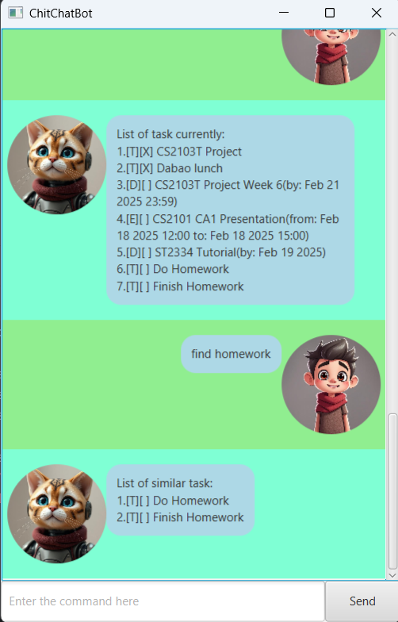

# ChitChatBot
## User Guide
ChitChatBot is a **Java-based personal assistant chatbot** that helps user to **track tasks efficiently**.
It is optimized for use via **Command Line Interface (CLI)** while still having the benefits of a **Graphical User Interface**

 

* [Quick start](#quick-start)
* [Features](#features)
* - Adding a todo task: [`todo`](#adding-a-todo-task-todo)
* - Adding a event task: [`event`](#adding-an-event-task-event)
* - Adding a deadline task: [`deadline`](#adding-a-deadline-task-deadline)
* - Listing all tasks: [`list`](#listing-all-tasks-list)
* - Deleting a task: [`delete`](#deleting-a-task-delete)
* - Mark a task as completed: [`mark`](#marking-a-task-mark)
* - Unmark a task as not yet completed: [`unmark`](#unmarking-a-task-mark)
* - Finding tasks by description: [`find`](#finding-task-by-description-find)
* - Undoing a command: [`undo`](#undoing-a-command-undo)
* - Exiting the program: [`bye`](#exiting-the-program-bye)

## Quick start
1. Ensure you have Java `17` installed in your Computer. 
   **Mac User:** Ensure you have the precise JDK version prescribed [here](https://se-education.org/guides/tutorials/javaInstallationMac.html).
2. Download the latest `.jar` file from here.
3. Open a command terminal, `cd` into the folder you put the jar in, and use the `java -jar chitchatbot.jar` 
command to run the application. 
Or you can double-click the `.jar` file to launch it.  
A GUI similar to the below should appear. 

4. Type the command in the command box and press Enter or click the Send button to execute it. 
Some example commands you can try:
5. - `todo Do Homework`: Add the task to do homework
- - `deadline Assignment 1 /by 16/02/2025 1800`: Add a task with deadline
- - `mark 1`: Mark the 1st task as completed.
- - `unmark 1`: Unmark the 1st task as not yet completed.
- - `delete 1`: Delete the first task.
- - `bye`: Exits the app
6. Refer to the Features below for details of each command

## Features
### Adding a todo task: `todo`
Add a todo task to be tracked by ChitChatBot.
Format: `todo <Description>`

Example: 
* `add Do Homework`

### Adding an event task: `event`
Add an event task to be tracked by the ChitChatBot. 
> [⚠ **Note**]
> Event task requires both date and time.
> The from date should be earlier than the to date, similarly for time. 

Format: `event <Description /from dd/MM/yyyy hhMM /to dd/MM/yyyy hhMM>`

Example:
* `event Play Game /from 16/02/2025 1200 /to 16/02/2025 2000`

### Adding a deadline task: `deadline`
Adding a task with deadline to be tracked by ChitChatBot. 
> [⚠ **Note**]
> For deadline task, time argument is optional

Format:
* `deadline /by dd/MM/yyyy`
* `deadline /by dd/MM/yyyy hhMM`

Examples:
* `deadline Finish ChitChatBot /by 16/02/2025 2359` 
* `deadline Finish ChitChatBot /by 17/02/2025`

### Listing all tasks: `list`
Shows a list of all the task currently tracked by ChitChatBot

Format: `list`
>[⚠ **Note**] 
> Any extra arguments after list will be ignored and the usual list command will be executed. 

Examples:
* `list`
* `list abcd`: list command will be executed as per normal. 

### Deleting a task: `delete`
Deletes a specified task from ChitChatBot using the task index.

Format: `delete <INDEX>`
* Deletes a task at the specified `INDEX`.
* The index refers to the index number shown in the displayed task list on the left of the task.
* The index must be a positive integer from 1.
* The index must the index of a existing task.

Example:
* `delete 1`: deletes the first task in the task list.

### Marking a task: `mark`
Marks a specified task as completed.

Format: `mark <INDEX>`
* Marks a task at the specified `INDEX` as completed.
* The index refers to the index number shown in the displayed task list on the left of the task.
* The index must be a positive integer from 1.
* The index must be the index of a existing task.
* Only tasks that are not yet completed can be marked.

Example:
* `mark 1`: marks the first task in the task list as completed.

### Unmarking a task: `mark`
Unmark a specified task as not yet completed.

Format: `unmark <INDEX>`
* Unmarks a task at the specified `INDEX` as not yet completed.
* The index refers to the index number shown in the displayed task list on the left of the task.
* The index must be a positive integer from 1.
* The index must be the index of a existing task.
* Only tasks that are completed can be unmarked.

Example:
* `unmark 1`: unmarks the first task in the task list as not yet completed.

### Finding task by description: `find`
Finds the tasks whose description contains all the given keywords.

Format: `find <KEYWORDS...>`
* The search is case-insensitive. e.g `HOMEWORK` will match `homework`. 
* Tasks matching all the keywords will be returned. e.g. `find homework` will
find both `Do Homework` and `Finish Homework`
* Only the description of a task is searched

Examples:
* `find homework`: returns `Do Homework` and `Finish Homework`.
* `find do homework`: returns `Do Homework`. 
 

### Undoing a command: `undo`
Undo the most recent command that modified the data.

Format: `undo`
>[⚠ **Note**]
> Only can undo the most recent command that modified the data. 
> Command such as find and list unable to undo.

Examples:
* `delete 1`: deletes the first task in the task list followed by `undo` will undo the `delete 1` command.
* `mark 1`: marks the first task as completed followed by `undo` will undo the mark 1 command and unmark the task.

### Exiting the program: `bye`
Exits the program
Format: `bye`
>[⚠ **Note**]
> Any extra arguments after bye will be ignored and the program will exit as normal. 
> Example: `exit abc`: the program will exit as normal.

### Saving the data file
ChitChatBot data are saved automatically as a TXT file under `[JAR file location]/data/chat.txt`.

### Command summary
| Action                                               | Format, Example                                                                                                                                               |
|------------------------------------------------------|---------------------------------------------------------------------------------------------------------------------------------------------------------------|
| **Add todo task**                                    | `todo <Description>`  e.g., `todo Homework`                                                                                                               |
| **Add event task**                                   | `event <Description> /from dd/MM/yyyy hhMM /to dd/MM/yyyy hhMM` e.g., `event Attend Lecture /from 16/02/2025 1200 /to 16/02/2025 1400`                    |
| **Add deadline task**                                | `deadline <Description> /by dd/MM/yyyy hhMM(Optional)` e.g., `deadline Assignment 1 /by 16/02/2025`   `deadline Assignment 1 /by 16/02/2025 2359` |
| **List all task**                                    | `list`                                                                                                                                                        |
| **Delete a task**                                    | `delete 1`                                                                                                                                                    |
| **Mark a task as completed**                         | `mark 1`                                                                                                                                                      |
| **Mark a task as not yet completed**                 | `unmark 1`                                                                                                                                                    |
| **Find task based on descriptions**                  | `find <Keywords...>` e.g., `find Homework`                                                                                                                |
| **Undo the previous command that modified the data** | `undo`                                                                                                                                                        |
| **Exit the program**                                 | `bye`                                                                                                                                                         |

